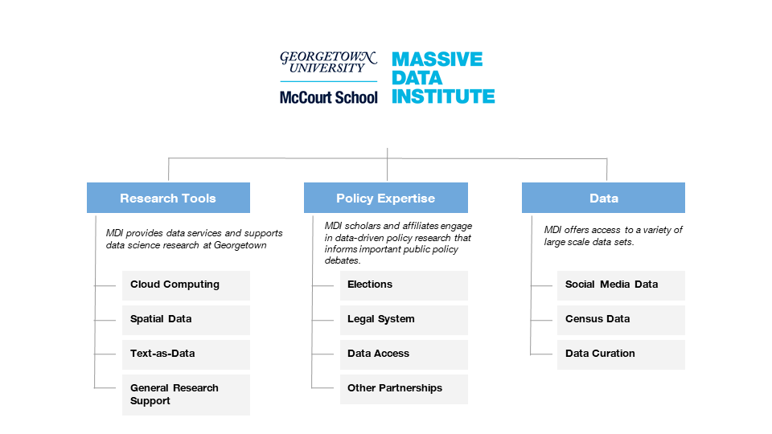

```{r setup, include=FALSE}
# Clear objects from memory
rm(list = ls(all = TRUE))   
options(htmltools.dir.version = FALSE)
library(here)
library(knitr)
#library("DiagrammeR")
```

class: title-slide

background-image: url(Figures/McCourtTitle.png)


.bg-text[
<hr /> 
## Massive Data
## Institute

<hr />
<!-- Michael Bailey -->
]


---
  
# Mission
MDI harnesses modern computing power to improve public policy.

--

<br>

### Organizing principles

  - Interdisciplinary: MDI brings together social scientists, computer scientists and others from all schools at Georgetown.

  - Entrepreneurial: MDI seeks out and supports projects that involve novel uses of data and computing power.
  
  - Partnership-driven: MDI leverages partnerships and external funding. 
  
---

class: hide-logo


<br>


```{r, dpi = 2000, out.width="85%", fig.align = 'center', echo = FALSE}

```


---

class: left, middle, inverse, hide-logo
background-position: center
background-size: cover

background-image: url("Figures/McCourtTitle.png")

# Cutting-Edge
# Research


---

## Computing Resources


#### Achievements
Georgetown scholars have used cloud computing to connect new forms of large-scale data to societal scale issues ranging from corruption in public-private partnerships to climate change to understanding civil service to global biodiversity. Some projects have created databases that will become shared repositories for researchers  while others involve large-scale simulations.

#### Services
We provide access to cloud computing for faculty who need large-scale and fast computing resources.  Our services include compute clusters, large-scale databases including Postgres and BigQuery and access to statistical packages for large-scale data and private cloud-based storage. 

We will be increasing our services next year to include creation of data portals and data labeling services using Mechanical Turk.

#### Contacts
- Lisa Singh (MDI Research Professor)
- Virinche Marwadi (MDI System Administrator)

---

## Advanced Data Science Research

#### Achievements

MDI scholars have used text-as-data tools to analyze social media and newspaper data the understand the 2020 US election, online social movements ([#MeToo](https://papers.ssrn.com/sol3/papers.cfm?abstract_id=3520217) and [#BlackLivesMatter](https://mccourt.georgetown.edu/news/mining-social-media-to-analyze-change/)), [forced migration](https://dl.acm.org/doi/10.1145/3292500.3330774) in Iraq, [Covid misinformation](https://link.springer.com/article/10.1007/s42001-020-00093-6) and [gun ownership](https://www.ncgvr.org/grants/2019/deploying-social-media-data.html).

MDI also convenes events designed to build the text-as-data and spatial data communities at Georgetown.

#### Services
We build and support a community of scholars doing research on text as data.  This includes programming for faculty and a Phd-oriented working group.  We hope to offer a web-scraping consulting service via our MDI Fellow.

#### Contacts
- Jaren Haber (MDI Fellow)
- Michael Bailey (MDI Director)

---

## Research support

#### Achievements
The [MDI Scholars](https://mccourt.georgetown.edu/news/mccourt-massive-data-institute-scholars-big-data-public-policy/) program provides undergraduate and graduate students from a broad range of disciplines with research experience using large-scale data. The Scholars have participated in over 10 different research projects led by faculty across campus and policy partners such as the World Bank.

Funded by a substantial NSF grant, MDI Research Professor Sing directs a interdisciplinary group of scholars who develop research tools for scholars using social media and other modern data in cross-disciplinary research.

MDI's seed grants have funded Georgetown researchers in Public Policy, Biology, Business, Government, the School of Foreign Service and elsewhere.  Scholars receiving these grants have gone on to raise over $3.5 million in grants.


#### Services
MDI can connect researchers to faculty and student data science experts. MDI can also provide support for researchers applying for grants.

#### Contacts
- Tricia Waller (Director, Grants Administration for MDI)


---


class: left, middle, inverse, hide-logo
background-position: center
background-size: cover

background-image: url("Figures/McCourtTitle.png")

# Policy
# Impacts


---

## Partners

#### Achievements
MDI works with partners on projects using modern data tools to improve public policy. Partners have included a [government agency](https://www.washingtonpost.com/local/dc-politics/georgetown-university-works-with-dc-agency-to-improve-rental-inspection-policies/2020/01/17/7756a568-3945-11ea-bb7b-265f4554af6d_story.html) in Washington

MDI also sponsors Fellows that work directly on policy problems.  One works with the Lab@DC (in the office of the Washington DC Mayor).  Another Fellow works on racial justice in the law with the Justice Innovation Lab.  This Fellow is sponsored by MDI and the Beeck Center as part of Georgetown's Tech & Society Initiative. Another Fellow works with the Department of Education to help them coordinate sharing of data across units.

#### Services
MDI can work with local governments, public policy organizations and university researchers to create a team that can provide high end data services in a data-driven analysis of a public policy question.

#### Contact
- Amy O'Hara (MDI Research Professor)
- Michael Bailey (MDI Director)


---

## Democracy

#### Achievements
MDI has undertaken projects assessing the nature and content of election information.  This work is joint with the University of Michigan.  This work includes high-profile, current-use [data](https://s3mc.org/political-communication/) on election dynamics at [CNN](https://www.cnn.com/2020/08/16/politics/election-2020-polls-biden-trump-breakthrough/index.html).


#### Services
MDI is eager to collaborate with scholars interested in using our data or building off our experience analyzing campaigns and elections.


#### Contact
- Lisa Singh (MDI Research Professor)
- Michael Bailey (MDI Director)


---

## Data Access and Policy


#### Achievements
MDI has engaged directly with local governments and nonprofit organizations to provide expertise and support on the ethical and effective sharing and reuse of data. Our ADRI and SPE projects have received generous support from the Sloan Foundation to promote the use and linkage of administrative data.

MDI Research Professor Amy O'Hara has also had a high profile in public conversations about [Census](https://www.washingtonpost.com/local/social-issues/what-the-supreme-courts-rulings-mean-for-the-2020-census-and-trumps-attempt-to-exclude-the-undocumented-from-the-count/2020/10/17/5d299b98-0f71-11eb-8a35-237ef1eb2ef7_story.html) and [other government](https://www.bea.gov/evidence) data, in her role on the Advisory Committee on Data for Evidence Building.


#### Services
MDI offers [guides of best practices and a directory of intermediaries](https://adri.georgetown.edu). We are also developing a data use agreement (DUA) generator through a partnership with the National Head Start Association.  Our Facebook project helped assess their efforts to provide social scientists access to some of their data.

A Fellow hired under the auspices of Georgetown's Tech & Society program assesses bias and other ethical issues associated with algorithmic analysis of social media data.

#### Contact
- Amy O'Hara (MDI Research Professor)


---

## Legal system

#### Achievements
MDI is engaged in multiple projects related to the U.S. legal system.  
- Working with the Georgetown University Law Center, we are creating a [civil justice data commons](https://www.georgetowntech.org/cjdc-blog/aciviljusticedatacommons) that will help researchers understand racial and other implications of civil justice in the United States.
- Working with the [Justice Innovation Lab](https://www.justiceinnovationlab.org/), MDI researchers are trying to make the legal process more fair at the prosecutorial level.
- MDI researchers developed innovative measures of the influence of law and politics on the [Supreme Court](https://www.washingtonpost.com/politics/2020/09/22/if-trump-appoints-third-justice-supreme-court-would-be-most-conservative-its-been-since-1950/).

#### Services
We are eager to join with researchers interested in these and other projects at the intersection of law and data.

#### Contacts
- Amy O'Hara (MDI Research Professor)
- Michael Bailey (MDI Director)


---


class: left, middle, inverse, hide-logo
background-position: center
background-size: cover

background-image: url("Figures/McCourtTitle.png")

# Harnessing
# Data


---

## Federal Statistical Research Data Center 

#### Achievements
The FSRDC is open!  Thanks to the Restarting Research protocols and collaboration between the McCourt School and Census Bureau, our approved researchers can safely and securely access restricted data.  The FSRDC has generated interest across area non-profits and institutions.  Scholars using our U.S. Census Bureau Research Data Center have produced multiple working papers and journal articles. 

#### Services
MDI provides access to non-public U.S. Census data at our secure on-sight U.S. Census Research Data Center.  We support researchers by helping them learn about what data is available, apply for access and, if approved, to access the data.  Executive Director Amy O'Hara serves on the FSRDC Technical Committee and on the FSRDC Budget Committee.  She also works with the Census Bureau to streamline data request processes and improve linkage methods.

#### Contact
- Amy O'Hara (FSRDC Director)

---

## Social Media Data Portals

We have developed four portals to date: election 2020, covid-19, and parenting. These portals are controlled by research teams, but allow for construction of variables from social media and newspaper data through easy to use forms. It is particularly valuable for those with limited large-scale data programming skills. 

#### Services
MDI is developing a service that will give researchers access to variables constructed from the Twitter decahose. 

#### Contact
- Lisa Singh (MDI Research Professor)


---

## Data curation

#### Achievements
We have developed efficient approaches for storing and processing large-scale data sets. Currently, we have eight projects that are curating different social media and newspaper data sets.

#### Services
MDI can provide scholars with access to certain specific data sets.  One is a large scale database of more than 700 million publicly available, open-source media articles and blog posts actively compiled since 2006 from a wide range of non-English sources.  Another is a very large data set of anonymized credit information.

MDI also makes available [administrative data metadata](https://mccourt.georgetown.edu/research/research-data-center/administrative-data-metadata/) obtained through data use agreements with federal and state agencies which show the specific data elements shared with the census in order to improve research designs and increase the specificity of proposals.

We are also exploring whether we can assist in other data access projects.

#### Contacts
- Amy O'Hara (FSRDC Director)
- Lisa Singh (MDI Research Professor)
- Michael Bailey (MDI Director)
